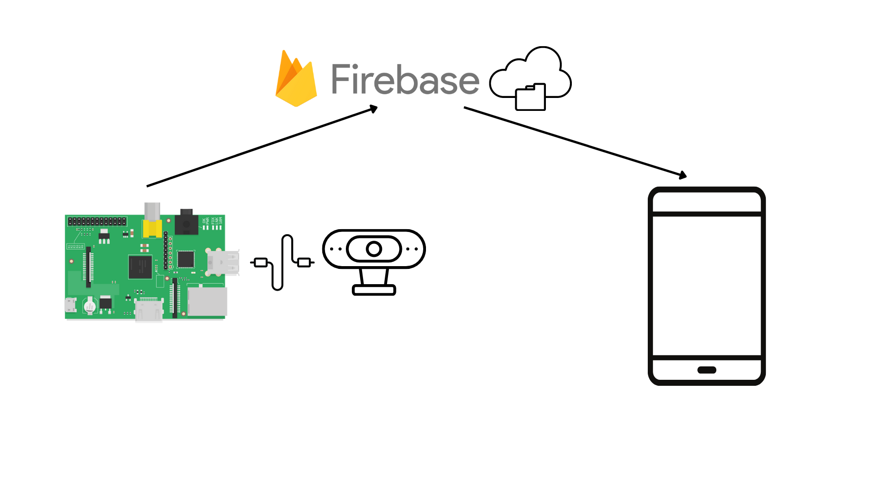

# Team Ravenclaw

(team project)

## Team members and roles:

- Mos Daniele - AI dev | Embedded integration
- Moraru Dora - Android app dev | Web dev
- Ioanna Caba - Android app dev | Front end designer

## Name: Road sign detection

## Details:

The main idea of the project is to train a lite road sign recognition model in Python so that it could run on the limited power that a Raspberry Pi has.

We would use a web cam or a Raspberry Pi camera module to get the input data for the detection, which is the video stream that the camera provides. The model is than applied on each frame of the input stream, highlighting and tracking the sign that it detected. 

An android app will receive the video stream that the camera got and draw the positions in which the model detected the road signs. So the user could see the detections and review the detections.

## Hardware:

- Raspberry Pi
- Web cam
- Power Adapter
- SD Card
- Smartphone

## Running process:

In order to run the program we need to have the mobile app installed. After that, the python script needs to be running on the raspberry pi with a working network connection. 

The python script will use the camera connected to the pi device to capture the video stream and apply the sign detection inference on it.

If it detects any signs from the available ones, it will cut out a square of that detected sign and send it to the cloud storage through Firebase.

The app will detect the changes to the cloud storage and display the latest successfully detected traffic signs almost in real time. 

## Schematic:
